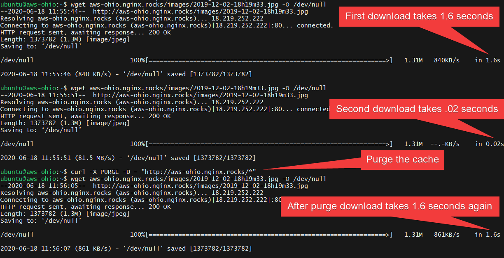

# docker-caching-example

To use:
1. edit etc/nginx/conf.d/cdn.conf with your specific needs. especially the server in the upstream.
2. add repo keys to base folder

In my demo I build an excessively large image site (like retail would have, only larger images for obvious delays) <https://github.com/jessegoodier/docker-backend-site-for-CDN-demo>

Demo site with a lot of latency: <http://aws-singapore.nginx.rocks/>
Demo CDN <http://aws-ohio.nginx.rocks/>

NGINX Plus dashboard: <http://aws-ohio.nginx.rocks:8080/>

Also explore the API for additional metrics:
>curl http://aws-ohio.nginx.rocks:8080/api/1 |jq

https is enabled also:
Demo site with a lot of latency: <https://aws-singapore.nginx.rocks/>
Demo CDN <https://aws-ohio.nginx.rocks/>

#remove cache directories before build
sudo rm -rf var/cache/nginx/*

docker run -it -p 80:80 -p 443:443 -p 8080:8080 --volume $PWD/etc/nginx:/etc/nginx --volume $PWD/var/cache/nginx:/var/cache/nginx --name=nginx-cdn nginx-cdn:latest

